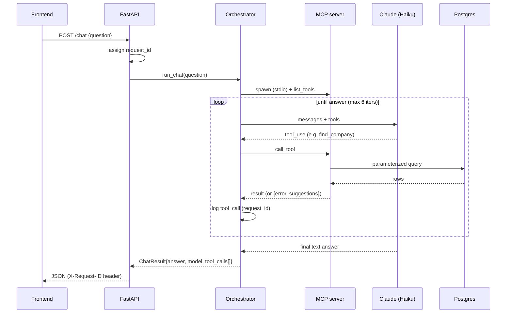

# Architecture

## Components

| Component | Stack | Role |
|-----------|-------|------|
| `frontend/` | Vite + React + TS | Chat UI; renders the answer and the agent's tool-call trace |
| `api/` | FastAPI | REST endpoints + `POST /chat`; thin adapter, translates `ServiceError` → HTTP |
| `chat/` | Anthropic SDK + MCP client | Tool-use loop; spawns the MCP server over stdio |
| `mcp_server/` | FastMCP (MCP SDK) | 5 tools over `core/`; recoverable errors; per-call audit |
| `core/` | psycopg | Pure typed functions; the **only** place SQL runs |
| Postgres | — | `companies`, `kpis`, `quarterly_estimates`, `qtd_estimates` |

## Why `core/` is shared

Both entry points (REST, MCP) need the same operations: resolve a company,
list its KPIs, pull history / QTD. Putting that logic in `core/` means:

- one implementation to test and harden;
- the MCP server talks to the DB directly instead of `MCP → HTTP → REST → DB`;
- the LLM↔data boundary is one small module (`core/db.py`), all parameterized.

## Request lifecycle: a chat question

If a tool returns `{error, suggestions}`, the model sees it and retries with a
suggested value — this is the designed recovery path, visible in `logs/app.log`.

## Failure isolation

- `core/` raises `ServiceError` for expected misses; the API maps it to a clean
  4xx, anything else to `500 {"error":"internal_error"}` with a logged traceback.
- The orchestrator has a catch-all boundary: it always returns a `ChatResult`
  (graceful message + whatever tool calls completed), never a 500.

## Deployment note (production)

Each box becomes its own container: the React app on a CDN/static host, FastAPI
behind a load balancer, the MCP server either co-located with the orchestrator
or exposed over HTTP/SSE transport for remote clients. Postgres managed.
Claude API auth via workload identity federation instead of a static key.
